# rnn_voice_classification

# Trabajo de Deep Learning

## Máster IA3 - Universidad de Valencia


 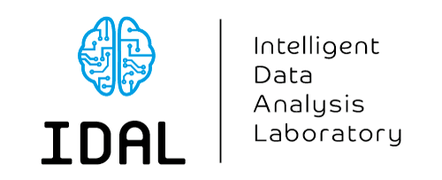

Este repositorio contiene los notebooks empleados para el trabajo de la asignatura de Deep Learning, así como los pesos de los modelos con los que se ha trabajado.


### Objetivos:
- Clasificar diferentes acentos hispanos mediante el uso de RNN.
- Comparar LSTM vs GRU


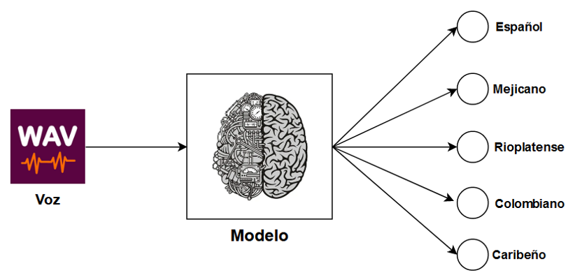

### Dataset:

Los audios se han obtenido de  "Common Voice" de Mozilla, en particular del subset "Common Voice Delta Segment 16.1" con voces en español.

https://commonvoice.mozilla.org/es

### Transformación de los audios:
En todos los notebooks se muestra la fase de exploración de los datos del dataset así como la transformación del fichero WAV a espectrograma de MEL.

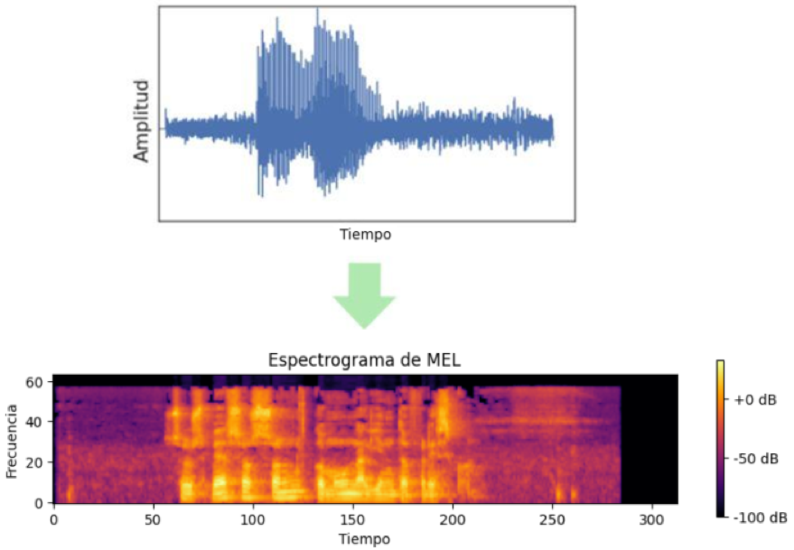

### Dataloader:
Se emplea la clase VoiceDataset para cargar los datos y realizar las transformaciones pertinentes del dataset, desde eliminar datos innecesarios como transformar los audios a espectrograma de MEL. 

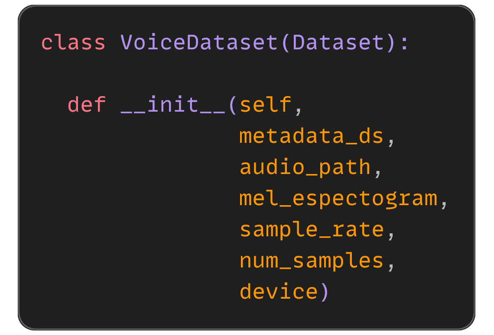

Se emplea el método mágico ```__get_item__``` para procesar todo los audios

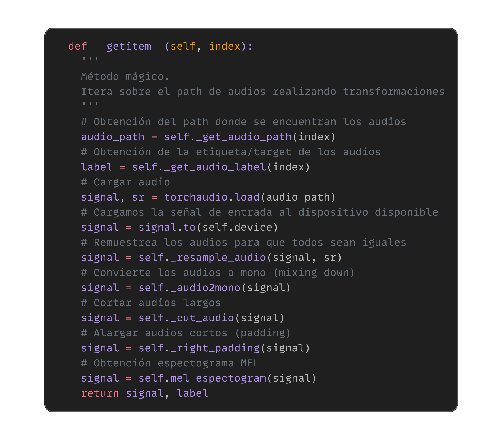

## Modelos:
### LSTM básico + 1FC:
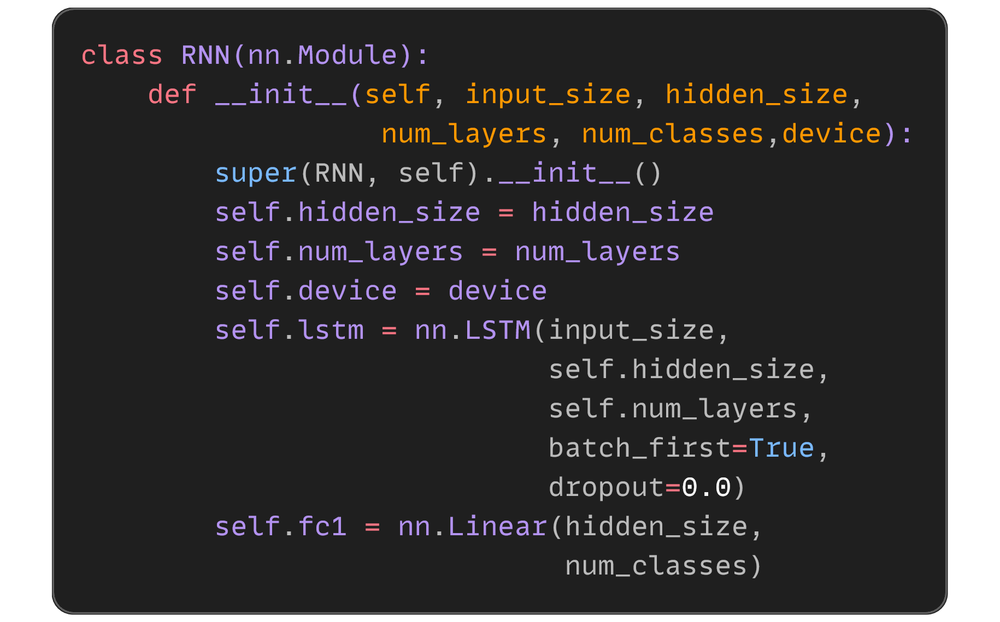

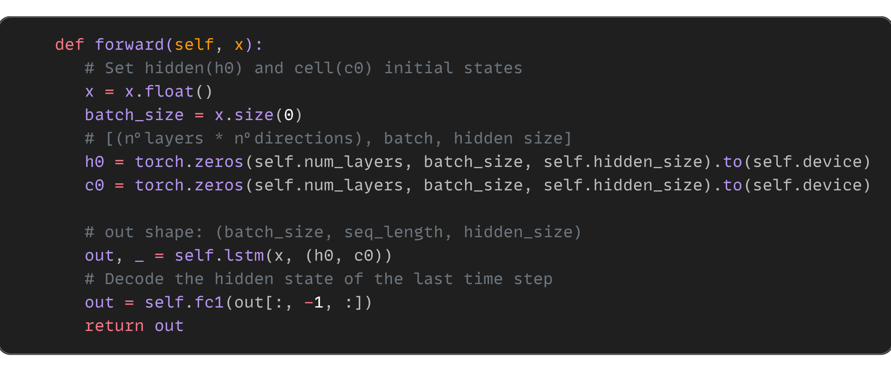

### GRU básico + 1FC:
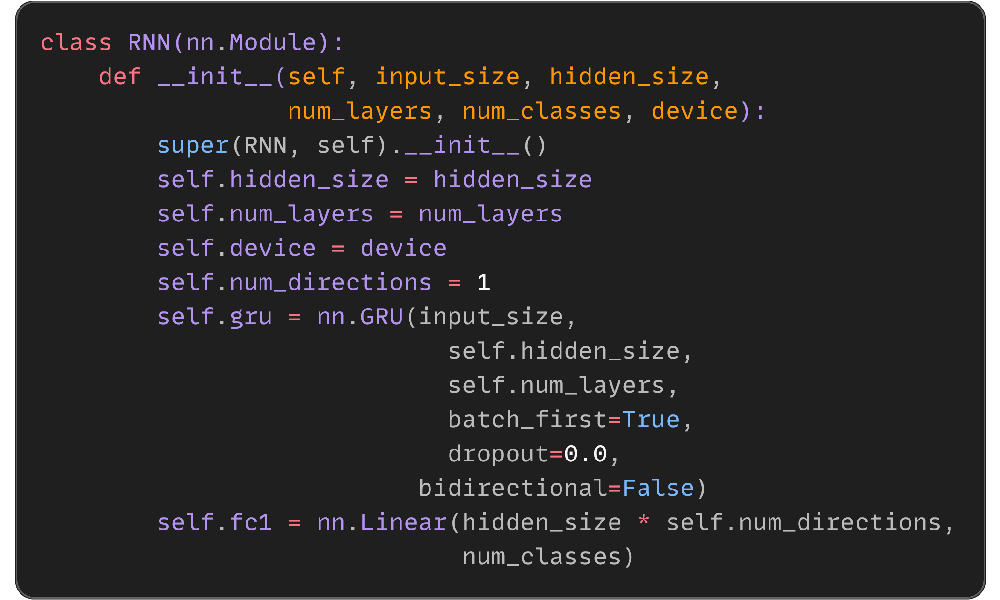

### GRU avanzado:
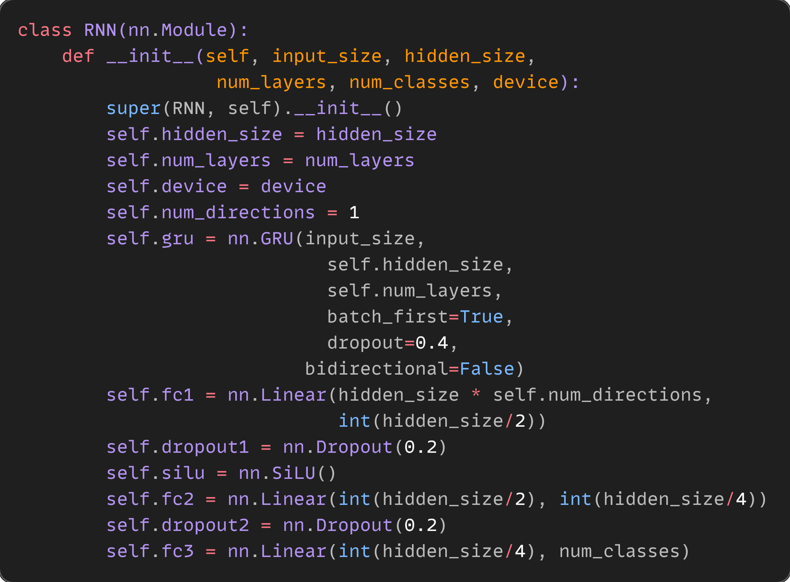

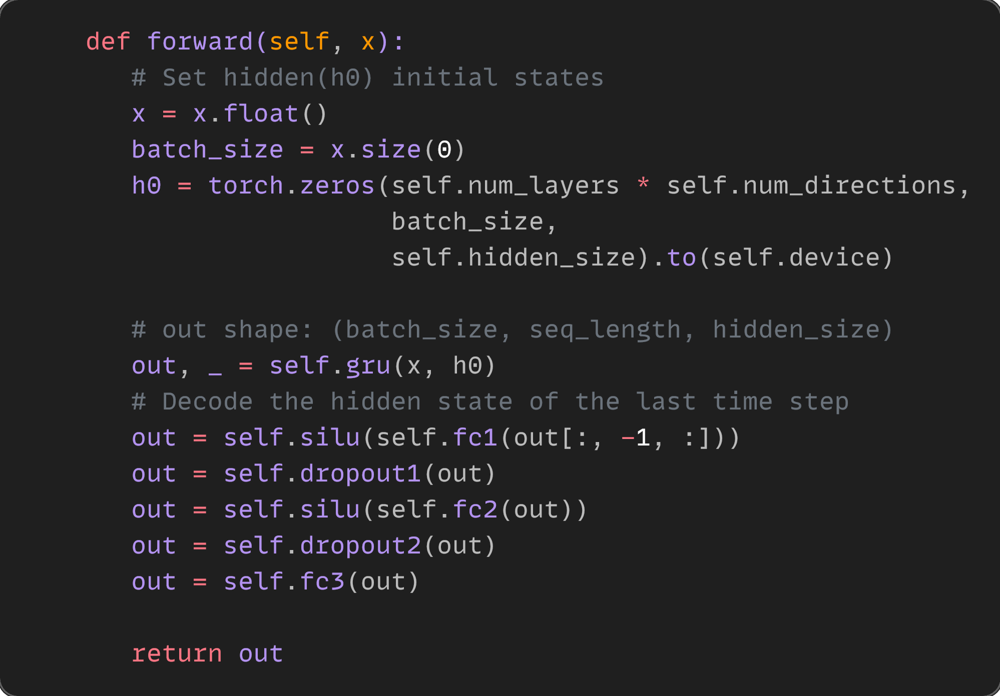

### Hiperparámetros:
Dado que se trata de un problema de clasificación con múltiples clases se ha decidido emplear el método ```CrossEntropyLoss``` [link](https://pytorch.org/docs/stable/generated/torch.nn.CrossEntropyLoss.html).

El optimizador empleado es el método ```Adam```.

El scheduler empleado para la reducción dinámica de 'learning rate' es ```ReduceLROnPlateau```.

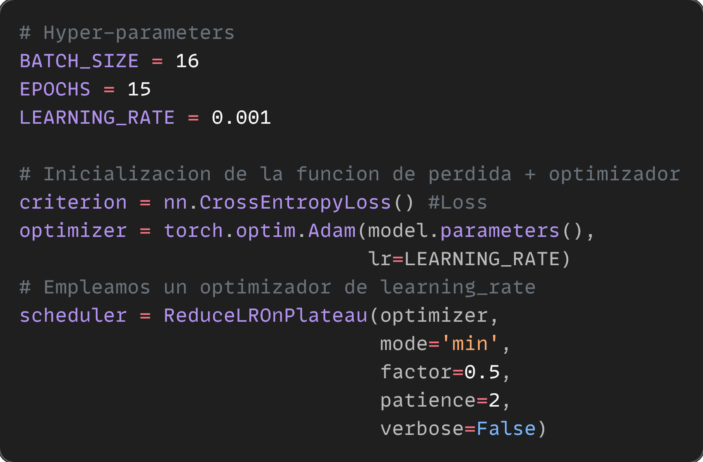

### Fases de Test y Train:
#### Fase de test:

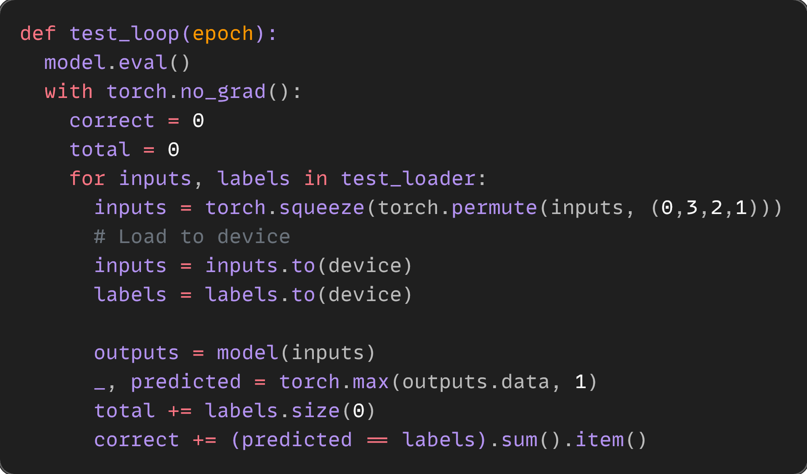

#### Fase de train:

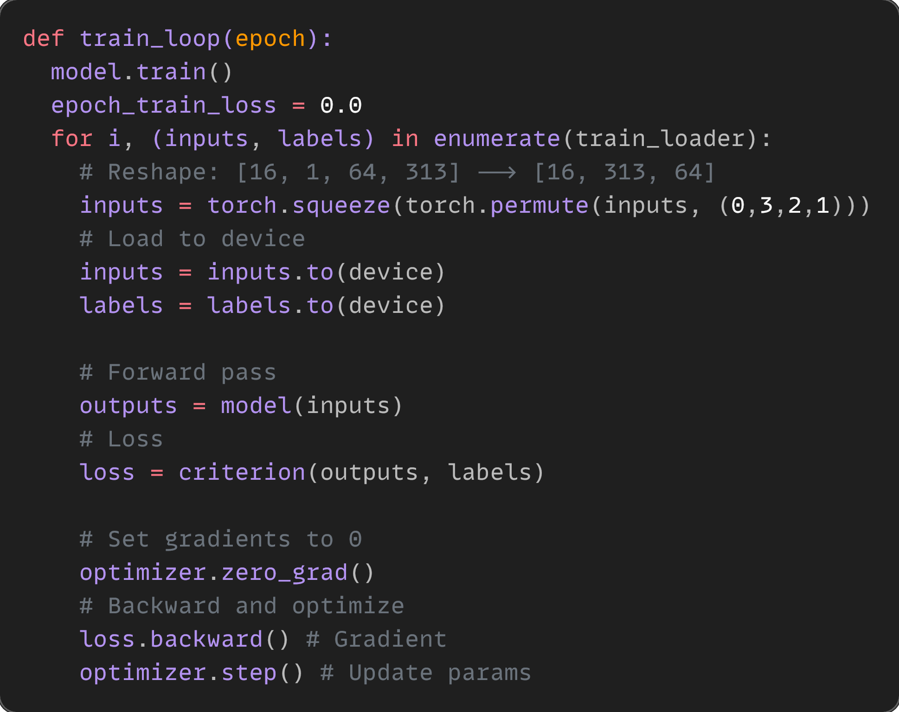


### Librerías:
  